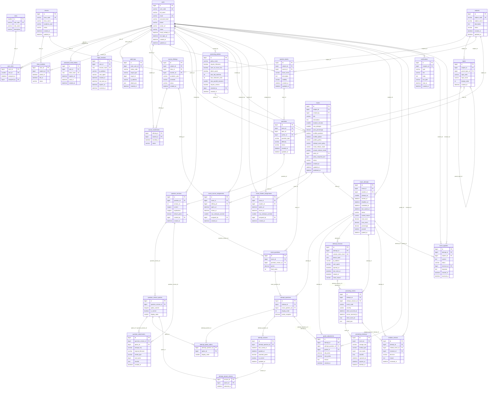

# Online Exam — ERD (34 bảng)

Mỗi cạnh được ghi bằng cột FK. FK nullable dùng quan hệ cha tùy chọn.
Xem `docs/database-design.md` cho quy tắc Service vượt ngoài FK.

```mermaid
erDiagram
    users {
        bigint id PK
        varchar user_code UK
        varchar full_name
        varchar email UK
        varchar password_hash
        varchar phone
        varchar avatar_url
        varchar status
        datetime email_verified_at
        datetime last_login_at
        datetime created_at
        datetime updated_at
    }
    roles {
        smallint id PK
        varchar role_code UK
        varchar role_name
        varchar description
    }
    user_roles {
        bigint user_id PK
        smallint role_id PK
        datetime assigned_at
        bigint assigned_by FK
    }
    password_reset_tokens {
        bigint id PK
        bigint user_id FK
        char token_hash UK
        datetime expires_at
        datetime used_at
        datetime created_at
    }
    login_sessions {
        bigint id PK
        bigint user_id FK
        char session_hash UK
        varchar ip_address
        varchar user_agent
        datetime created_at
        datetime last_seen_at
        datetime expires_at
        datetime revoked_at
    }
    audit_logs {
        bigint id PK
        bigint actor_user_id FK
        varchar action_code
        varchar target_type
        bigint target_id
        varchar ip_address
        json detail_json
        datetime created_at
    }
    subjects {
        bigint id PK
        varchar subject_code UK
        varchar subject_name
        text description
        varchar status
        datetime created_at
        datetime updated_at
    }
    classes {
        bigint id PK
        varchar class_code UK
        varchar class_name
        varchar academic_year
        varchar status
        datetime created_at
        datetime updated_at
    }
    class_students {
        bigint class_id PK
        bigint student_id PK
        datetime joined_at
        datetime left_at
        varchar status
    }
    course_offerings {
        bigint id PK
        bigint subject_id FK
        bigint class_id FK
        bigint teacher_id FK
        varchar academic_year
        varchar semester
        varchar status
        datetime created_at
    }
    course_enrollments {
        bigint offering_id PK
        bigint student_id PK
        datetime enrolled_at
        varchar status
    }
    topics {
        bigint id PK
        bigint subject_id FK
        bigint parent_topic_id FK
        varchar topic_code
        varchar topic_name
        int display_order
        datetime created_at
    }
    question_banks {
        bigint id PK
        bigint subject_id FK
        bigint owner_id FK
        varchar bank_name
        text description
        varchar visibility
        datetime created_at
        datetime updated_at
    }
    questions {
        bigint id PK
        bigint bank_id FK
        bigint topic_id FK
        bigint author_id FK
        varchar question_type
        varchar difficulty
        varchar status
        datetime created_at
        datetime updated_at
    }
    question_versions {
        bigint id PK
        bigint question_id FK
        int version_no
        longtext content
        longtext explanation
        decimal default_points
        bigint created_by FK
        datetime created_at
    }
    question_version_options {
        bigint id PK
        bigint question_version_id FK
        longtext option_content
        boolean is_correct
        smallint display_order
    }
    question_attachments {
        bigint id PK
        bigint question_version_id FK
        bigint option_id FK
        varchar storage_key
        varchar original_filename
        varchar media_type
        bigint size_bytes
        char sha256
        datetime created_at
    }
    proctoring_policies {
        bigint id PK
        varchar policy_name
        boolean require_fullscreen
        boolean warn_on_focus_loss
        boolean detect_paste
        int max_tab_switches
        int max_fullscreen_exits
        smallint max_parallel_sessions
        boolean require_camera
        bigint created_by FK
        datetime created_at
    }
    exams {
        bigint id PK
        bigint subject_id FK
        bigint created_by FK
        varchar title
        text instructions
        smallint duration_minutes
        smallint max_attempts
        decimal pass_percentage
        boolean shuffle_questions
        boolean shuffle_options
        varchar grading_policy
        varchar attempt_score_policy
        varchar result_release_mode
        varchar answer_release_mode
        bigint policy_id FK
        json policy_snapshot_json
        varchar status
        datetime created_at
        datetime updated_at
        datetime published_at
    }
    exam_questions {
        bigint id PK
        bigint exam_id FK
        bigint question_version_id FK
        decimal points
        int fixed_order
    }
    exam_course_assignments {
        bigint id PK
        bigint exam_id FK
        bigint offering_id FK
        datetime opens_at
        datetime closes_at
        smallint max_attempts_override
        bigint assigned_by FK
        datetime created_at
    }
    exam_student_assignments {
        bigint id PK
        bigint exam_id FK
        bigint student_id FK
        datetime opens_at
        datetime closes_at
        smallint max_attempts_override
        bigint assigned_by FK
        datetime created_at
    }
    exam_attempts {
        bigint id PK
        bigint exam_id FK
        bigint student_id FK
        smallint attempt_no
        datetime started_at
        datetime deadline_at
        datetime submitted_at
        datetime last_saved_at
        varchar status
        varchar submit_reason
        decimal total_score
        decimal max_score
        decimal percentage
        boolean passed
        datetime graded_at
    }
    attempt_questions {
        bigint id PK
        bigint attempt_id FK
        bigint exam_question_id FK
        int display_order
        decimal points_snapshot
    }
    attempt_option_orders {
        bigint attempt_question_id PK
        bigint option_id PK
        smallint display_order
    }
    attempt_answers {
        bigint id PK
        bigint attempt_question_id FK
        datetime last_saved_at
        datetime graded_at
        decimal awarded_points
        boolean is_correct
        datetime updated_at
    }
    attempt_answer_choices {
        bigint answer_id PK
        bigint option_id PK
        datetime selected_at
    }
    grade_adjustments {
        bigint id PK
        bigint attempt_id FK
        bigint attempt_question_id FK
        bigint grader_id FK
        decimal old_points
        decimal new_points
        text reason
        datetime created_at
    }
    attempt_sessions {
        bigint id PK
        bigint attempt_id FK
        char session_token_hash UK
        char device_hash
        varchar ip_address
        varchar user_agent
        datetime opened_at
        datetime last_seen_at
        datetime closed_at
        varchar close_reason
    }
    proctoring_events {
        bigint id PK
        bigint attempt_id FK
        bigint attempt_session_id FK
        varchar event_code
        varchar severity
        datetime client_occurred_at
        datetime server_received_at
        char client_event_id
        json detail_json
    }
    proctoring_evidence {
        bigint id PK
        bigint event_id FK
        varchar storage_key
        varchar media_type
        bigint size_bytes
        char sha256
        datetime captured_at
        datetime expires_at
        datetime deleted_at
    }
    violation_reviews {
        bigint id PK
        bigint attempt_id FK
        bigint related_event_id FK
        bigint reviewer_id FK
        varchar decision
        text reason
        datetime reviewed_at
    }
    notifications {
        bigint id PK
        bigint recipient_id FK
        varchar type
        varchar title
        text body
        varchar link_path
        datetime read_at
        datetime created_at
    }
    exam_appeals {
        bigint id PK
        bigint attempt_id FK
        bigint student_id FK
        text content
        varchar status
        bigint reviewer_id FK
        text response
        datetime created_at
        datetime resolved_at
    }
    users ||--o{ user_roles : "user_id"
    roles ||--o{ user_roles : "role_id"
    users |o--o{ user_roles : "assigned_by"
    users ||--o{ password_reset_tokens : "user_id"
    users ||--o{ login_sessions : "user_id"
    users |o--o{ audit_logs : "actor_user_id"
    classes ||--o{ class_students : "class_id"
    users ||--o{ class_students : "student_id"
    subjects ||--o{ course_offerings : "subject_id"
    classes ||--o{ course_offerings : "class_id"
    users ||--o{ course_offerings : "teacher_id"
    course_offerings ||--o{ course_enrollments : "offering_id"
    users ||--o{ course_enrollments : "student_id"
    subjects ||--o{ topics : "subject_id"
    topics |o--o{ topics : "parent_topic_id"
    subjects ||--o{ question_banks : "subject_id"
    users ||--o{ question_banks : "owner_id"
    question_banks ||--o{ questions : "bank_id"
    topics |o--o{ questions : "topic_id"
    users ||--o{ questions : "author_id"
    questions ||--o{ question_versions : "question_id"
    users ||--o{ question_versions : "created_by"
    question_versions ||--o{ question_version_options : "question_version_id"
    question_versions ||--o{ question_attachments : "question_version_id"
    question_version_options |o--o{ question_attachments : "option_id + question_version_id"
    users ||--o{ proctoring_policies : "created_by"
    subjects ||--o{ exams : "subject_id"
    users ||--o{ exams : "created_by"
    proctoring_policies |o--o{ exams : "policy_id"
    exams ||--o{ exam_questions : "exam_id"
    question_versions ||--o{ exam_questions : "question_version_id"
    exams ||--o{ exam_course_assignments : "exam_id"
    course_offerings ||--o{ exam_course_assignments : "offering_id"
    users ||--o{ exam_course_assignments : "assigned_by"
    exams ||--o{ exam_student_assignments : "exam_id"
    users ||--o{ exam_student_assignments : "student_id"
    users ||--o{ exam_student_assignments : "assigned_by"
    exams ||--o{ exam_attempts : "exam_id"
    users ||--o{ exam_attempts : "student_id"
    exam_attempts ||--o{ attempt_questions : "attempt_id"
    exam_questions ||--o{ attempt_questions : "exam_question_id"
    attempt_questions ||--o{ attempt_option_orders : "attempt_question_id"
    question_version_options ||--o{ attempt_option_orders : "option_id"
    attempt_questions ||--o{ attempt_answers : "attempt_question_id"
    attempt_answers ||--o{ attempt_answer_choices : "answer_id"
    question_version_options ||--o{ attempt_answer_choices : "option_id"
    exam_attempts ||--o{ grade_adjustments : "attempt_id"
    attempt_questions ||--o{ grade_adjustments : "attempt_question_id + attempt_id"
    users ||--o{ grade_adjustments : "grader_id"
    exam_attempts ||--o{ attempt_sessions : "attempt_id"
    exam_attempts ||--o{ proctoring_events : "attempt_id"
    attempt_sessions |o--o{ proctoring_events : "attempt_session_id + attempt_id"
    proctoring_events ||--o{ proctoring_evidence : "event_id"
    exam_attempts ||--o{ violation_reviews : "attempt_id"
    proctoring_events |o--o{ violation_reviews : "related_event_id + attempt_id"
    users ||--o{ violation_reviews : "reviewer_id"
    users ||--o{ notifications : "recipient_id"
    exam_attempts ||--o{ exam_appeals : "attempt_id + student_id"
    users ||--o{ exam_appeals : "student_id"
    users |o--o{ exam_appeals : "reviewer_id"
```
